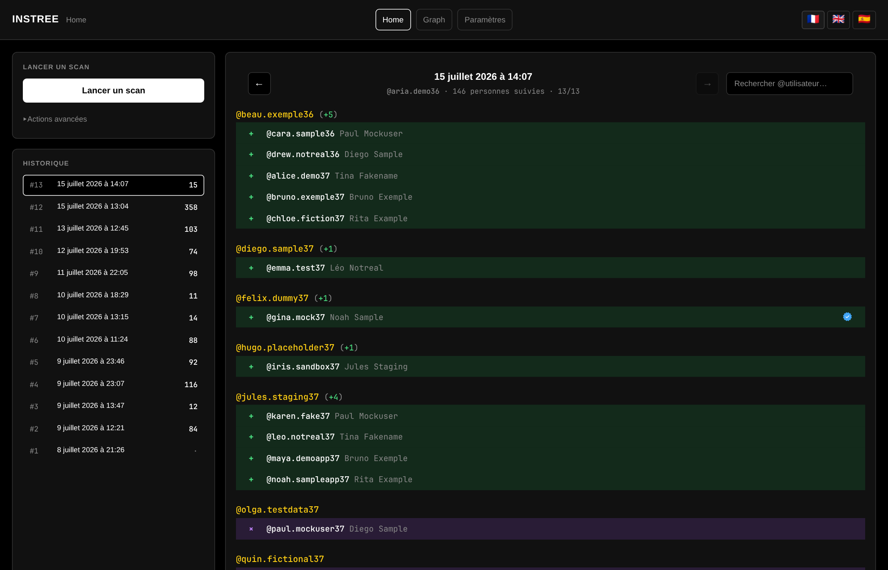
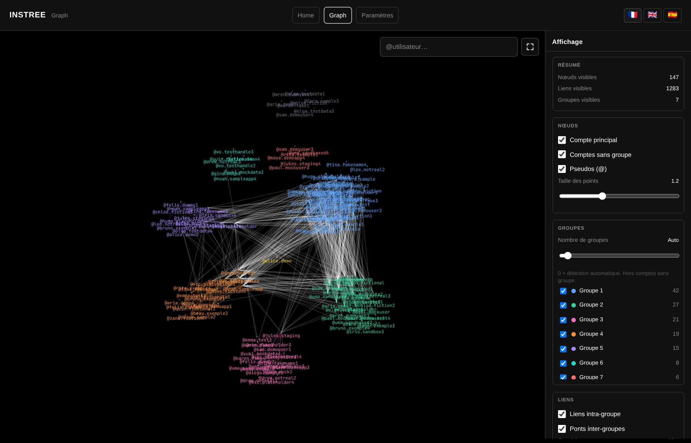
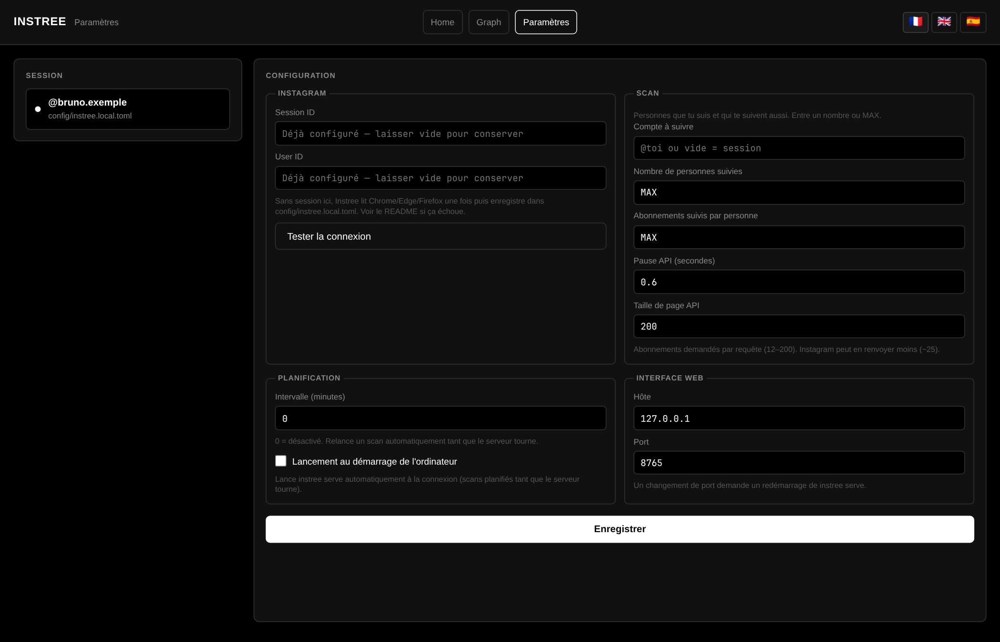

# Instree

Surveillance **locale** de tes abonnements mutuels Instagram (tu les suis, ils te suivent). Chaque scan compare ta liste, puis les abonnements de chaque mutuel.

| Symbole | Sens |
|---------|------|
| `>` | ajouté à **ta** liste |
| `+` / `−` | un mutuel s’est abonné / désabonné |
| `×` | compte supprimé ou renommé |
| pastille jaune **mutuel** | déjà dans ta liste |
| pastille bleue | compte vérifié |

Interface web en FR / EN / ES. Données uniquement dans `data/` (SQLite).

---

## Installation

### Windows

1. Télécharge le projet (ZIP GitHub ou `git clone`).
2. Double-clique **`run.bat`**.

Au premier lancement : Python (winget si besoin), dépendances, config, ouverture de [http://127.0.0.1:8765](http://127.0.0.1:8765).

### Linux / macOS

```bash
git clone https://github.com/CloudDown/instree.git
cd instree
./run
```

Au premier lancement : installation de **uv** si besoin, Python 3.11+, dépendances, config locale, ouverture du navigateur sur [http://127.0.0.1:8765](http://127.0.0.1:8765).

Ensuite : **Paramètres** → session Instagram → **Home** → lancer un scan.

Si Instagram limite les requêtes (`feedback_required`), Instree affiche une pause avec compte à rebours puis réessaie. Les snapshots des mutuels sont sauvés au fil de l’eau : tu peux **relancer** un scan après un blocage / cancel — les comptes déjà traités sont sautés. Plafond `max_person_following` (défaut 2000) pour éviter les listes énormes quand `watch_n = MAX`.

---

## Session Instagram

**Auto (recommandé)**  
Connecté sur [instagram.com](https://www.instagram.com) → ferme le navigateur → **Paramètres** → **Tester la connexion**.  
Les cookies vont dans `config/instree.local.toml` (gitignored).

**Manuel** si l’auto échoue : F12 → Cookies → `instagram.com` → copie `sessionid` et `ds_user_id` dans **Paramètres**.

---

## Les 3 pages

### Home — scans & historique



Lancer un scan, parcourir l’historique, et lire les changements d’un scan :

- liste des scans à gauche (baseline, dates, nombre de changements) ;
- détail groupé par mutuel suivi, avec compteurs `(+N −M)` ;
- recherche `@utilisateur` (accents ignorés, historique mis en avant) ;
- légende cliquable : masquer un type de ligne (ajouts, suppressions, mutuels, vérifiés…).

### Graph — réseau des mutuels



Vue force-directed de ta communauté :

- nœuds colorés par groupe (communautés détectées) ;
- panneau **Display** : taille des nœuds, groupes, liens intra / inter ;
- recherche d’un `@` avec zoom sur le nœud ;
- mode plein écran pour explorer confortablement.

### Paramètres — session & config



Configurer Instree sans éditer les fichiers à la main :

- session Instagram (`sessionid` / `ds_user_id`) et test de connexion ;
- taille des scans (`n`, `watch_n`, `max_person_following`, délais API) ;
- planification (intervalle auto, lancement au démarrage) ;
- host / port de l’interface web.

---

## Config utile

| Fichier | Contenu |
|---------|---------|
| `config/instree.toml` | `n`, `watch_n`, `max_person_following`, port, intervalle |
| `config/instree.local.toml` | session Instagram |

Les mêmes options sont éditables dans **Paramètres**.
